# September 14: First version on a XIAO ESP32-C3

Started the project properly today. The idea is an alarm clock that doesn't
just blast you at a fixed time — it gets a window (say 06:50 to 07:20) and
picks the moment inside that window when you're already half awake. And if
you got up before the window even opened, it just doesn't ring.

Went with the XIAO ESP32-C3 because it's tiny and I already had one. Set up
PlatformIO, got a Phase 1 scaffold compiling: ST7789 display driver, a piezo
on LEDC PWM, 12 keys through two 74HC165 shift registers, and a PIR sensor
for motion. Drew a first schematic in KiCad around a bare ESP32-C3 chip.

Everything built. Felt good. Did not test on hardware yet, which turned out
to matter a lot tomorrow.

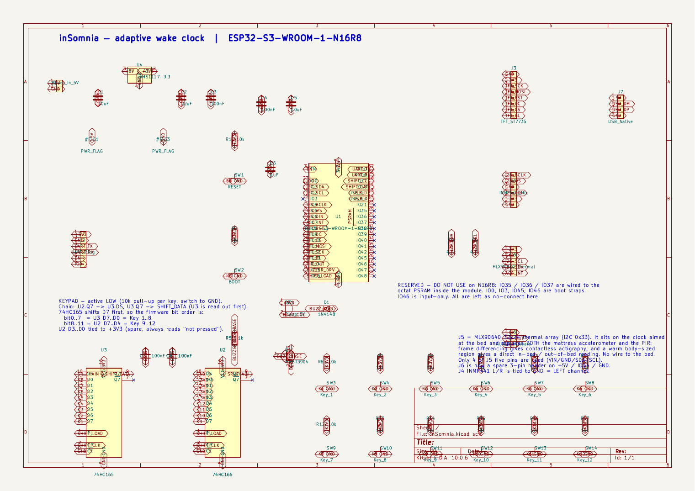

**Total time spent: 4 hours**

# September 15: The pin map was broken in three separate ways

Went back over the pin assignments before ordering anything, and it was a
mess. Genuinely glad I checked instead of trusting "it compiles".

Three real problems:

1. I'd assigned `TFT_MOSI` to GPIO0 and `TFT_SCK` to GPIO1. **Those pins are
   not broken out on the XIAO ESP32-C3.** I checked `pins_arduino.h` in the
   Arduino core and the board only exposes GPIO 2,3,4,5,6,7,8,9,10,20,21. On
   the C3 die GPIO0/1 are the 32 kHz crystal pins anyway.

2. Worse, those defines were doing nothing at all. I'd used
   `Adafruit_ST7789(cs, dc, rst)` which is the **hardware SPI** constructor —
   it ignores your pin defines and uses the default bus, which on the XIAO is
   SCK=GPIO8 and MOSI=GPIO10. Those were the exact pins I'd given to
   `SHIFT_CLK` and `SHIFT_LOAD`. The display and the keypad were fighting over
   the same two pins and the compiler had no way to tell me.

3. Wrong driver entirely. My panel is 128x160, which is an ST7735. I was
   using the ST7789 class. Looked at the library source and `init(128,160)`
   falls into a fallback branch that applies an 80-row / 56-column offset, so
   the image would have been shifted garbage.

Also found that LEDC channels 0 and 1 share a hardware timer
(`timer = (channel/2) % 4`), so the buzzer changing pitch would have dragged
the backlight PWM frequency with it. Moved the backlight to channel 2.

And my screen layout maths assumed portrait while I'd set rotation 1, so half
the text was drawing off-screen.

Fixed all of it, pinned the platform version so a clean checkout can't pull a
core where `ledcSetup` no longer exists, and got it building again. Four bugs
that would each have cost me an evening with a soldering iron.

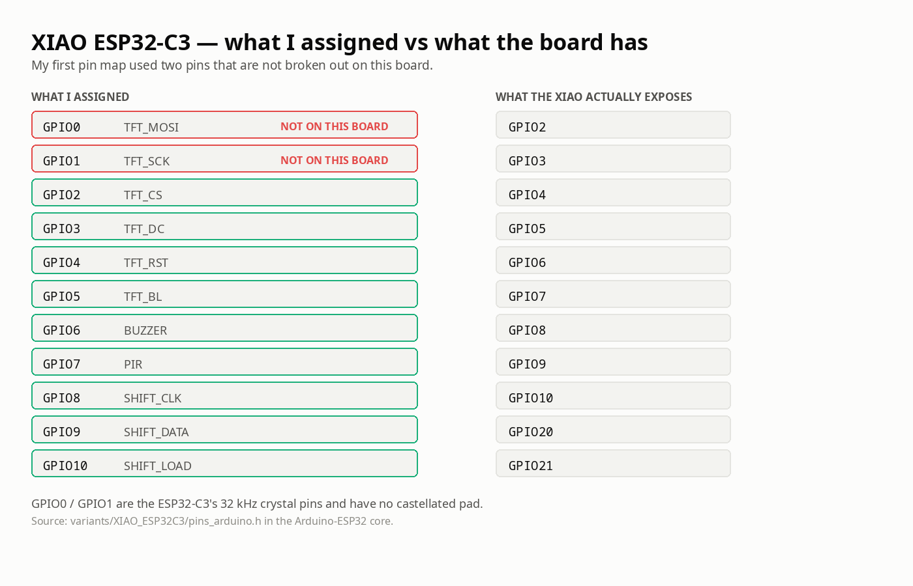

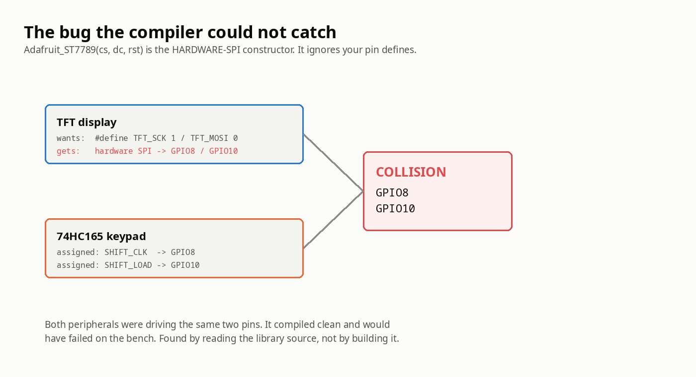

**Total time spent: 3 hours**

# September 15: Reading actual papers about whether this idea even works

Before building more I wanted to know if "detect sleep from sensors" is real
or if I was about to build something that just makes up numbers. Spent a
while reading validation studies. Two findings changed the design.

**Actigraphy is about 78-80% accurate** for sleep vs wake against clinical
polysomnography (big MESA dataset, 1440 people). But the breakdown matters:
sensitivity to *sleep* is 0.88-0.96, while specificity for *wake* is only
**0.35-0.64**. It's good at spotting sleep and bad at spotting wakefulness.

**Sound-based staging is no better.** The best smartphone-audio model I found
(HomeSleepNet) gets 76.2% overall but only **63.4% on wake epochs**.

So both approaches are weakest at exactly the thing my "you're already up,
stay quiet" feature depends on. If I'd driven suppression off the sleep
classifier, it would have failed at its one job maybe a third of the time.

Changed the design because of this: suppression is now driven by a separate,
blunt out-of-bed check (mattress accelerometer quiet AND room PIR active),
which is close to a binary measurement instead of a 64%-accurate guess.

The other thing I learned is that the validated algorithms (Cole-Kripke,
Sadeh) are **actigraphy** algorithms — they need motion counts from an
accelerometer, not PIR zone crossings. So I added an LIS3DH to go on the bed
frame. That way I'm standing on published work instead of thresholds I made up.

I also want to be straight about this in the project: Cole-Kripke is a
weighted moving average with a threshold from 1992. Calling it AI would be
lying. I'm not shipping a trained model because I have no polysomnography
ground truth to validate one against.

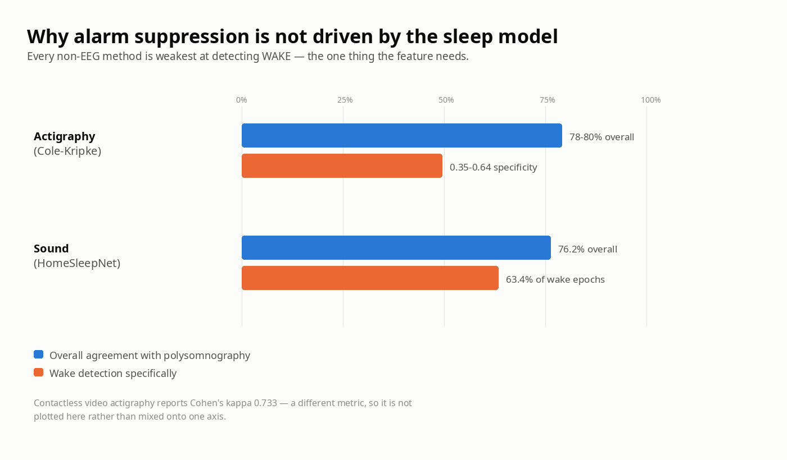

**Total time spent: 3 hours**

# September 15: Switched to ESP32-S3 and redrew the whole schematic

Adding an I2S microphone killed the C3. Counted it up: TFT needs 5 pins, I2S
needs 3, buzzer 1, PIR 1 — that's 10 of 11, leaving one pin for a keypad
interface that needs three. Doesn't fit.

Moved to the **ESP32-S3-WROOM-1-N16R8**: way more GPIO, 8 MB PSRAM, and it has
a stock KiCad symbol so the redraw got easier rather than harder. Deleted the
old schematic and rebuilt from scratch — 53 components: the module, two
74HC165s, AMS1117 regulator, buzzer with a proper transistor driver, headers
for the TFT / mic / accelerometer / PIR / USB / UART, 12 keys with pull-ups,
reset and boot buttons, and decoupling.

Two annoying things while building it:

- An interrupted operation half-wrote, so `U2`, `U3`, `C7`, `C8` and 34 net
  labels all ended up **duplicated**. ERC caught it as weird "Output and
  Output connected" errors at the shift registers. Took a while to work out
  that two identical chips were stacked on the same coordinates.
- Three pads on U1 came out on stale net names (`PIR_IN`, `VCC`) left over
  from the old board file. They were pins I'd marked no-connect — IO3, IO38,
  IO39. Had to go clear them by hand.

Also wrote down in the schematic which pins I must never touch on this part:
**IO35/36/37 are wired to the PSRAM inside the module**, and IO0/IO3/IO45/IO46
are boot straps. That's the kind of thing I'd definitely forget in a month.

ERC clean, 0 violations.

**Total time spent: 4 hours**

# September 15: Sensor drivers and the sleep model

Wrote the rest of the firmware.

- **LIS3DH driver** — samples at 50 Hz, runs a slow high-pass to subtract out
  gravity, then rectifies and integrates the leftover into an activity count
  per 60-second epoch.
- **INMP441 I2S driver** — 16 kHz, gives RMS / peak / dBFS with a tracking
  noise floor. It's a loudness meter, not a classifier, and I labelled it that
  way in the code and the UI so I don't fool myself later.
- **Sleep model** — this is the bit I'm happiest with. It's deliberately *two*
  things. A causal 3-state machine (asleep / stirring / awake) with hysteresis
  that only looks backwards, because it drives the alarm in real time. And
  separately Cole-Kripke for the morning report, which needs the two
  *following* epochs and so lags 2 minutes and can never drive a live decision.
  Keeping those apart stopped me writing something that quietly cheats.
- **Alarm engine** — window logic, pre-window suppression, gentle ramp, hard
  deadline, snooze. Plus a failsafe: if the sensors stop responding it drops
  back to a plain fixed-time alarm at the deadline. It fails *safe*, never
  silent. That felt important for an alarm clock.
- **Web UI** — WiFi setup portal on first boot, then a dashboard at
  `insomnia.local` with live state, tonight's status, last night's numbers,
  and every threshold editable.

One thing I had to expose as a setting: Cole-Kripke's weights assume ActiGraph
counts, which is a proprietary unit. Mine are arbitrary numbers from my own
mattress. So there's a `countScale` calibration value that divides mine into
their range. The algorithm is validated; my scaling isn't, and pretending
otherwise would make the output meaningless.

Builds at 15.8% RAM and 13.2% flash, so plenty of room left.

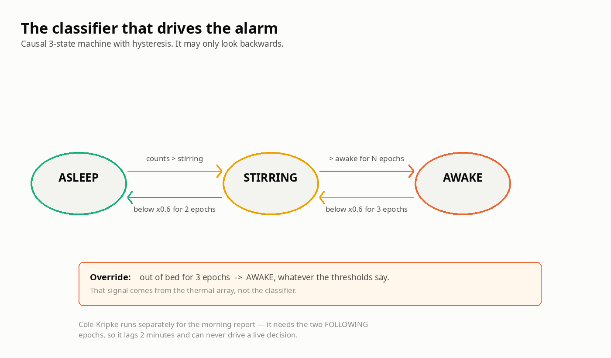

**Total time spent: 6 hours**

# September 15: Laying out and routing the board

Assigned footprints to all 53 parts and generated the board.

First placement attempt was bad — 18 courtyard overlaps. I'd guessed footprint
sizes instead of measuring them. Two things I had wrong: **pin headers anchor
at pin 1, not their centre**, and the WROOM-1 courtyard is **48 x 42 mm**, not
18 x 25, because of the antenna keepout region. Pulled the real geometry out
of KiCad and redid the placement properly. Second attempt: zero overlaps.

Placed the keypad by hand as a proper 4x3 grid rather than letting the
autoplacer scatter the buttons, because it's a thing a human presses.

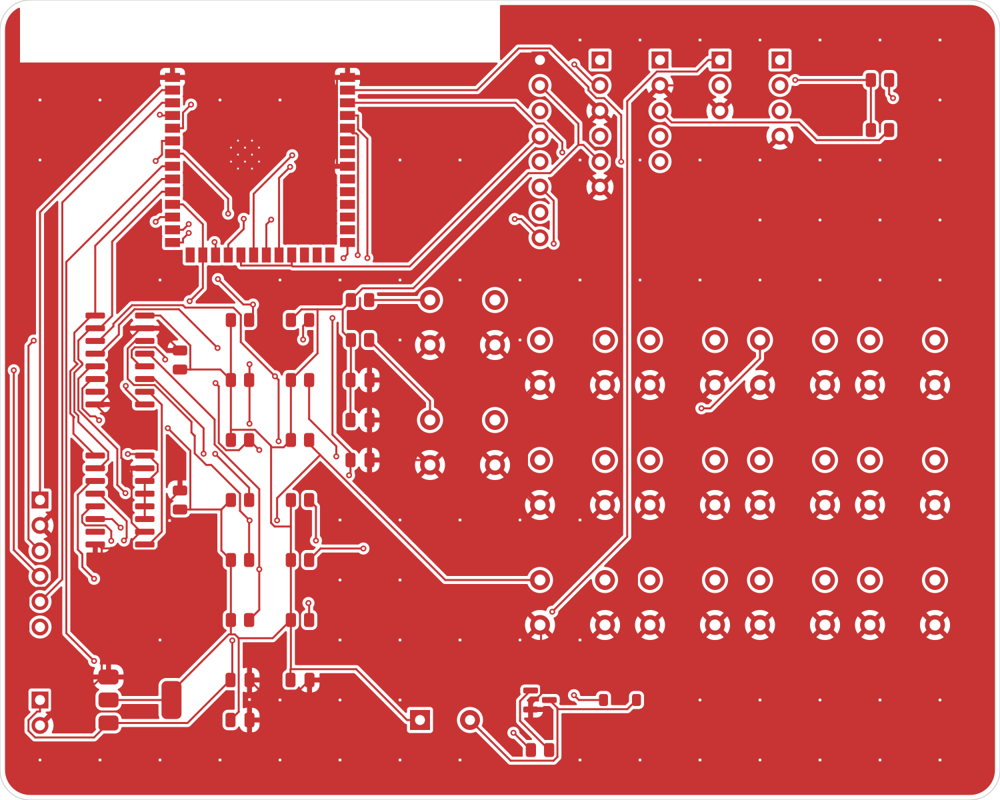

Autorouted with Freerouting, best of 5 runs. Attempt 5 won with all 21 of my
critical nets routed. Then a run of problems:

- Four duplicate dead-end track stubs near R3 that DRC flagged as dangling.
- **The copper pours were never actually filled.** The zones existed as empty
  outlines, which left a real ground break. Filled them via `pcbnew` and
  unconnected items went from 1 to 0.
- The antenna keepout in the footprint is **graphics only** — it isn't an
  enforced rule area, so the ground pour was happily filling copper under the
  antenna. Added a real keepout zone. My first attempt at it was oversized and
  clipped three tracks, so I sized it to the module's actual region instead of
  rerouting around my own mistake.
- One starved thermal on the TFT header's ground pin, fixed by bonding that
  pad solid to the plane.

Final: **DRC 0 violations, 0 unconnected items.** 737 tracks, 141 vias,
ground pour both layers, 100 x 80 mm.

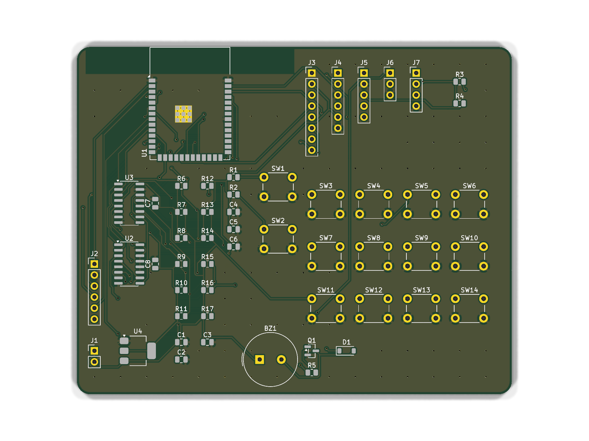

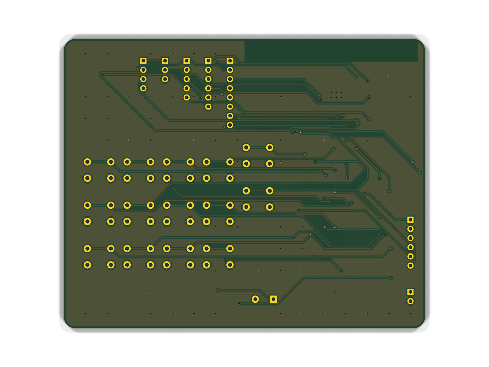

One thing I need to sort before ordering: there are twelve 0.20 mm holes on
the board. Every via I placed is 0.30 mm — the 0.20 mm ones are thermal vias
baked into KiCad's stock WROOM-1 footprint. A lot of cheap fab processes want
0.30 mm minimum, so I either pay more or delete those twelve vias. Noted it in
the hardware docs rather than finding out when the order gets rejected.

Nothing has been fabricated or powered on yet. DRC clean means the geometry is
consistent, not that the design works.

**Total time spent: 5 hours**

# September 15: Scrapped the bed sensor and went thermal instead

Was about to submit when I realised the accelerometer plan had a hole in it.
The LIS3DH sits on the bed. The clock sits on the nightstand. That's a metre
or two of I2C cable between them — and I2C is only specced for 400 pF of bus
capacitance, which works out to roughly **1 metre at 100 kHz**. Normal cable is
100–240 pF per metre. So I'd have been right on the edge, and my driver was
running at 400 kHz which makes it worse. Classic "works on the desk, dies at
3am" setup.

Went looking for a way to sense movement without any wire going to the bed.
Landed on a **MLX90640** — a 32x24 thermal array. It sits on the clock and
looks at the bed.

Spent a while checking whether this is actually a real approach or just a nice
idea, and it holds up better than the accelerometer did:

- **Video actigraphy is validated at Cohen's kappa 0.733** against proper sleep
  lab polysomnography. That's substantial agreement and about the same as a
  wrist actigraph. Frame-to-frame change in the image is the contactless
  equivalent of a motion count, so it feeds straight into Cole-Kripke.
- Thermal arrays are already used for occupancy detection and positioning, work
  in complete darkness, and don't need any lighting.
- A duvet **attenuates** body heat but doesn't block it. Heat builds up under
  the cover and your head is usually sticking out anyway.

The thing I like most: it replaces the PIR as well. "Is there a warm
person-sized blob in the bed region" is a much better out-of-bed test than a
PIR, because a PIR will happily trigger on a cat or a radiator. And that test
is what the whole context-aware-silence feature depends on, so it needed to be
the most reliable thing in the system.

One thing I'm deliberately not claiming: **posture**. I wanted "is she rolling
over / changing position" and at first thought I'd get posture classification
out of this. Then I found the paper that actually does it — they used an
infrared *depth* camera and had to synthesise blanket conditions to train it.
At 32x24 through a duvet that's a research project. So I'm reporting movement
magnitude and where the warm mass has shifted to, which is what the sleep model
actually consumes, and I'm calling it that instead of pretending it's posture.

Privacy side effect that I didn't plan but like: 768 temperature readings is
about a thousand times coarser than a phone photo. There's no way to identify
anyone from it, and nothing leaves the device anyway.

Rewrote the firmware around it — new thermal driver, ripped out the
accelerometer and PIR modules entirely, rewired the sleep model to take the
thermal motion index. Added a live thermal heatmap to the web dashboard, which
was very satisfying to get working even though I can't point it at anything yet.

Also finally built the **sleep debt** part, which was in my original pitch and I
hadn't done. Rolling 14 nights, `max(0, need - actual)` per night, plus a
recency-weighted version because recent sleep loss hits harder than loss from
two weeks ago. Van Dongen's 2003 study found 6 hours a night for 14 days leaves
you as impaired as two full nights without sleep, which is a genuinely alarming
number and made me want the feature more.

Hooked it into the alarm: if you're carrying debt, the gentle wake gets held
back by up to 15 minutes so one early stir doesn't rob you of the lie-in. **The
hard deadline never moves** — debt can delay the nudge, never the alarm. That
felt like an important line to draw.

Schematic ERC still clean, board DRC still clean (J5 just gets relabelled, the
netlist doesn't change since it was already an I2C header). Firmware builds at
20.1% RAM.

**Total time spent: 5 hours**

# September 15: Designed the enclosure in FreeCAD

Up to now the "case" only existed as a shape I'd eyeballed in Blender for a
render. Wanted a real one — something I can actually print — so I built it
parametrically in FreeCAD and drove every feature off the actual PCB
coordinates instead of guessing.

Outer shell is 106 x 86 x 54 mm with 2.5 mm walls, which gives a 101 x 81 mm
cavity for the 100 x 80 board. Wedge profile: 22 mm at the front lip, 54 mm at
the back, with the display face sloped at 44.1 degrees.

Features all cut from real numbers:

- **Display window 36 x 29 mm.** This was the thing I'd had badly wrong. I'd
  been modelling something like 62 x 42 in Blender. A 1.8" ST7735's *active
  area* is only about 35 x 28 mm — the module outline is much bigger than the
  bit that actually lights up. Window is active area plus 1 mm.
- **12 keypad holes** at the real SW3..SW14 positions pulled straight from the
  KiCad file. Had to account for the `SW_PUSH_6mm` footprint anchor not being
  centred — the body sits at anchor +(3.25, 2.25).
- Thermal aperture, buzzer grille, rear cable exit, vent slots over the
  regulator, and four M2 bosses for the board.

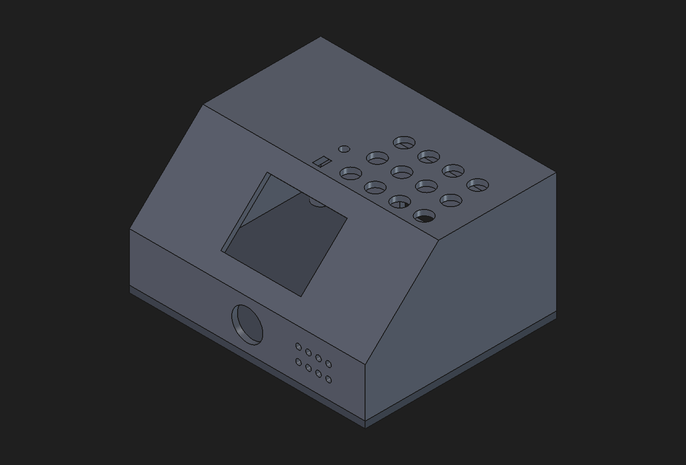

Hit one genuine conflict. My first flat-top started at y=38 mm, but the front
row of keys lands at y=39.25 with a 3.5 mm hole radius — so those holes were
being cut straight through the slope/flat edge and came out chewed. Moved the
flat forward to y=33 and they clear it now.

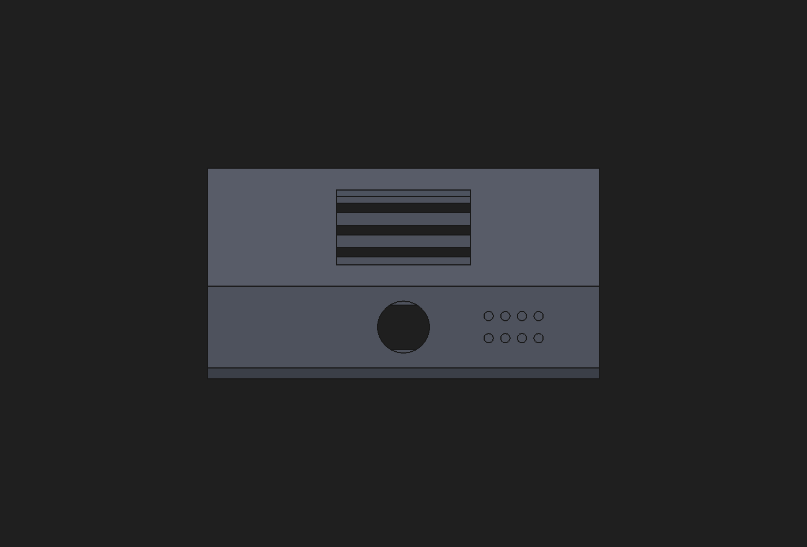

One thing I'm not happy about but am leaving alone: **the keypad sits
right-of-centre**, because that's where it is on the board. The left half is
full of the ESP32 module, shift registers, regulator and buzzer. It looks a bit
lopsided. Fixing it properly means re-laying-out the PCB, which I'm not doing
now — noting it as a v2 change.

Exported STEP and STL. About 58 cm3, so roughly 72 g of PLA at full infill.

Then rebuilt the Blender model against the FreeCAD numbers so the render
actually matches the thing I'd print, rather than being a separate fiction.
Worth saying plainly: the two tools aren't linked — I couldn't import the
FreeCAD mesh into the Blender scene through the tooling I have, so I re-entered
the same dimensions by hand. If I change the CAD I have to change both.

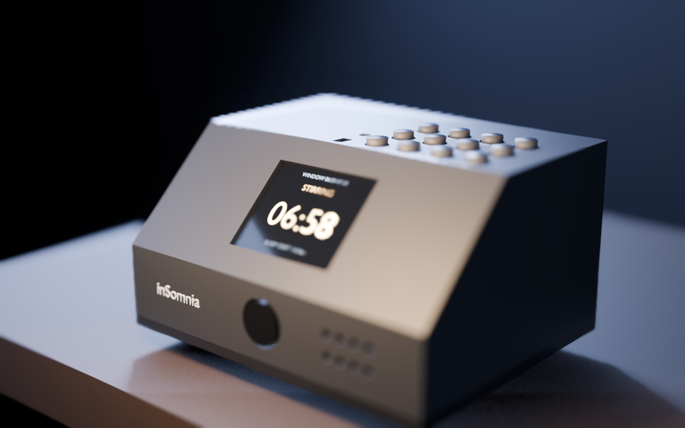

**Total time spent: 4 hours**

# September 15: Twelve buttons, and what they're actually for

Looked at the render and thought: why does an alarm clock have a numpad?

Checked the firmware. Twelve keys on the board, and `grep` found exactly **two**
`wasJustPressed` calls — dismiss and snooze. Ten buttons doing nothing.

They came from the original schematic, which already had SW1–SW12 and two
74HC165 shift registers before I started. I inherited it and never asked whether
the thing needed that many. Two options: use them or lose them. Losing them
means re-laying-out a board that's already DRC-clean, so I used them.

| | col 1 | col 2 | col 3 | col 4 |
|---|---|---|---|---|
| row 1 | DISMISS | SNOOZE | LIGHT | SKIP |
| row 2 | OPEN − | OPEN + | DEAD − | DEAD + |
| row 3 | PAGE | SOFT | LOUD | SAVE |

Front row is the half-asleep row — the stuff you hit without opening your eyes.
Back two rows are setup: move the window and deadline in 5-minute steps, page
between status / window / sleep-debt screens, fire a test alarm, save to flash.

The one I like is SKIP: it's the manual version of context-aware silence. The
automatic path waits for the thermal array to be sure you're out of bed. SKIP is
just you telling it directly.

Also added a little display page system so PAGE has somewhere to go, and toast
messages so you get feedback when a key does something. Still builds at 20.1% RAM.

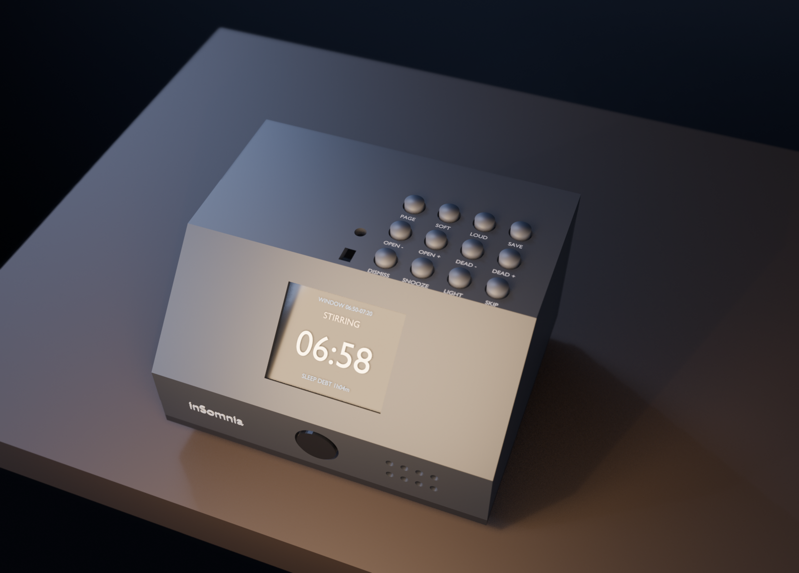

## Rendering it properly this time

The earlier renders went through a cloud 3D service. Turned out Blender was
sitting right there on my machine the whole time with the BlenderMCP addon
loaded, listening on 127.0.0.1:9876 — I just hadn't looked. Found it with `ss`
and talked to it over a plain TCP socket.

Which fixed the thing that had been bugging me: the cloud service could only
import from its own asset catalog, so I'd been *retyping* the FreeCAD dimensions
into Blender by hand and hoping they matched. Locally, Blender can just read the
STL off disk. So the render is now the actual exported CAD mesh — 7,628 verts
straight out of FreeCAD, scaled from mm to m, with the screen, key caps and
legends added on top.

That means the render and the printable part can't drift apart any more, which
is what I wanted from the start.

**Total time spent: 3 hours**
